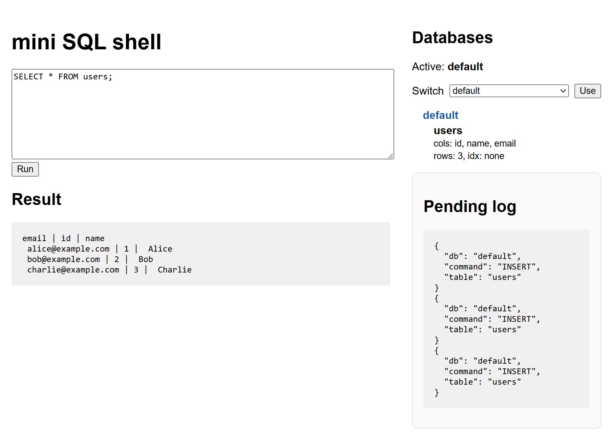

# mini sqlite 

## Polyglot SQL Engine 🧭

An educational project demonstrating a tiny SQL database engine implemented in three languages (Python, Go, Rust). Each implementation is a learning scaffold that covers parsing, query execution, a simple storage layer, a CLI shell and a minimal web UI. 🎓 (`Code generated by LLM`)

## Directories in the workspace 📁

- `mini_sqlite_python/` — Python edition (concise, easiest to run and modify) 🐍  
  - README: mini_sqlite_python/README.md  
  - Quick run:
    - CLI: python main.py ▶️
    - Web: python main.py --web 🌐
  - Data files: mini_sqlite_python/data/*.dat (auto-created per database)

- `mini_sqlite_golang/` — Golang edition (balanced simplicity and performance) 🐹  
  - README: mini_sqlite_golang/README.md  
  - Quick run:
    - CLI: go run main.go ▶️
    - Web: go run main.go -web 🌐
  - Data files: mini_sqlite_golang/data/*.dat (auto-created per database)

- `mini_sqlite_rust/` — Rust edition (type-safe, high performance) 🦀  
  - README: mini_sqlite_rust/README.md  
  - Quick run:
    - Build: cargo build --release 🛠️
    - CLI: cargo run --release ▶️
    - Web: cargo run --release -- --web 🌐
  - Data files: mini_sqlite_rust/data/*.dat (auto-created per database)

## SQL shell & Web UI

### 1. Web UI (Web Browser)



### 2. SQL shell (CLI)

```cmd
Welcome to the mini SQL shell. Type 'exit' to quit.
db> CREATE DATABASE demo;
Database 'demo' ready.
db> USE demo;
Using database 'demo'.
db> CREATE TABLE users (id INT, name TEXT, email TEXT);
Table 'users' created.
db> INSERT INTO users VALUES (1, 'Alice', 'alice@example.com');
1 row inserted.
db> INSERT INTO users VALUES (2, 'Bob', 'bob@example.com');
1 row inserted.
db> SELECT * FROM users;
id | name | email
1 | Alice | alice@example.com
2 | Bob | bob@example.com
db> SELECT name, email FROM users WHERE id = 2;
name | email
Bob | bob@example.com
db> UPDATE users SET email = 'alice.smith@example.com' WHERE id = 1;
1 row(s) updated.
db> ALTER TABLE users ADD COLUMN age INT;
Column 'age' added to 'users'.
db> UPDATE users SET age = 30 WHERE id = 1;
1 row(s) updated.
db> SELECT * FROM users;
id | name | email | age
1 | Alice | alice.smith@example.com | 30
2 | Bob | bob@example.com | None
db>
```

## Purpose & Scope 🎯

This project is intentionally small and educational:
- Demonstrates parser → executor → storage pipeline ⚙️
- Uses file-backed B-Tree pages persisted as compact `.dat` files 🗄️
- Provides a REPL (`db>`) and a tiny web UI for querying 💻
- Focuses on clarity over completeness or production-readiness ✅
- The BTreeStroage in the code is not an actual B-Tree. For simplicity, replace it with an in-memory dictionary.

## Where to start 🚀

1. Choose an implementation folder (python/go/rust). 📂  
2. Read that folder's README for implementation-specific instructions. 📖  
3. Try the example queries in examples/sample.sql inside each subproject (where present). 🧪
4. The root contains AGENT.MD (project goals and scaffolding plan) — see AGENT.MD. 📋  
5. Use the language-specific READMEs for in-depth commands, structure and next steps. 🔧

## Not implemented / Missing features ❗

The implementations in this workspace are intentionally minimal and educational. The following common relational-database features are not implemented yet and are good targets for future work:

<details>
<summary>Expand</summary>

- Query Capabilities
  - [ ] Extended WHERE clause support (AND, OR, complex expressions)
  - [ ] Aggregation functions (COUNT, SUM, AVG, MIN, MAX)
  - [ ] ORDER BY and GROUP BY clauses
  - [ ] Subqueries and correlated subqueries
  - [ ] Window functions (ROW_NUMBER, RANK, etc.)
  - [ ] Prepared statements and query parameterization

- Storage & Persistence
  - [ ] Write-ahead logging (WAL) for durability and crash-recovery
  - [ ] Background compaction and segment merging
  - [ ] Page-level caching and eviction policies
  - [ ] Checkpointing and snapshotting

- Transactions & Concurrency
  - [ ] Serializable / snapshot isolation levels
  - [ ] Lock manager or MVCC for concurrent access
  - [ ] Transaction rollback and rollback segments
  - [ ] Two-phase commit for distributed transactions

- Indexing & Query Optimization
  - [ ] B+tree persistent indexes for faster range scans
  - [ ] Hash indexes for equality lookups
  - [ ] Cost-based query planner and basic optimizations
  - [ ] Statistics collection for planning

- Error Handling & Validation
  - [ ] Comprehensive error messages and error codes
  - [ ] Input validation and SQL syntax diagnostics
  - [ ] Transaction rollback support on error
  - [ ] Strict type checking and casting rules

</details>

## Further reading

- [SQLite Architecture (official)](https://sqlite.org/arch.html) — deep dive into SQLite's architecture and internal design.
- [AOSABook: The "DBDB (Dog Bed Database)" chapter](https://aosabook.org/en/500L/dbdb-dog-bed-database.html) — practical walkthrough of building a simple database and core concepts.
- [cstack/db_tutorial](https://github.com/cstack/db_tutorial) — "Let's Build a Simple Database" tutorial (C) with clear explanations of storage and paging.
- [codecrafters-io/build-your-own-sqlite](https://github.com/codecrafters-io/build-your-own-sqlite) — guided project to reimplement SQLite-like features as an educational exercise.
- [msiemens/tinydb](https://github.com/msiemens/tinydb) — a lightweight, file-backed document DB in Python; useful reference for simple storage and API design.

## Contributing & Licensing 🤝

- Educational / MIT

## Acknowledgments 🙏

Built as a learning resource to understand database internals and storage engine design. 📚
