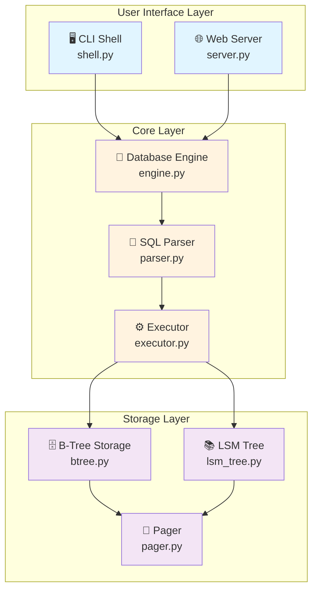

# 🐍 mini_sqlite

> 🎓 Educational lightweight SQL database engine built for learning storage and query processing internals - **Python Edition**

The original implementation: simple, concise, and perfect for learning database internals.

## ✨ Features

| Feature | Description |
|---------|-------------|
| 🔍 **SQL Parser** | Regex-based parser with dict dispatch for flexible parsing |
| ⚡ **Query Executor** | Efficient DDL/DML handler (CREATE, INSERT, SELECT, JOIN, etc.) |
| 💾 **Storage Engine** | Disk-backed B-Tree persisted as `.dat` pages with hash indexes |
| 💻 **CLI Shell** | Interactive REPL with `db>` prompt and command history |
| 🌐 **Web UI** | HTML interface with live schema tree at `http://127.0.0.1:8000` |
| 📦 **Zero Dependencies** | Pure Python standard library - no external packages |
| 🎯 **Concise Code** | Only ~620 lines - easy to understand and modify |
| 📖 **Readable** | Clean Python idioms, minimal boilerplate |

## 🏗️ Architecture



## 📦 Installation

### Prerequisites

**Python 3.12+ required**

```pwsh
# Check Python version
python --version

# Should show Python 3.12 or higher
```

### Run Instantly

```pwsh
# Navigate to project root
cd micro-sql-db-py-to-rust

# Run CLI mode - instant startup!
python main.py

# Run web mode
python main.py --web

# Custom host/port
python main.py --web --host 0.0.0.0 --port 3000
```

No build step, no dependencies to install - just run!

> ℹ️ Runtime data is persisted automatically under `data/<database>.dat` inside `mini_sqlite_python/`.

## 🚀 Quick Start

```sql
db> CREATE DATABASE demo;
Database 'demo' ready.
db> USE demo;
Using database 'demo'.

db> CREATE TABLE users (id INT, name TEXT, email TEXT);
Table 'users' created.

db> INSERT INTO users VALUES (1, 'Alice', 'alice@example.com');
1 row inserted.

db> CREATE INDEX users id;
Index on users.id built.

db> SELECT * FROM users WHERE id = 1;
id | name  | email
1  | Alice | alice@example.com

db> COMMIT;
Committed 1 entries.

db> exit
```

## 📖 SQL Reference

### Database Operations
```sql
CREATE DATABASE dbname;           -- Create and switch to database
ALTER DATABASE dbname;            -- Switch to existing database
USE dbname;                       -- Shortcut to switch databases
```

### Table Operations
```sql
CREATE TABLE users (id INT, name TEXT);
ALTER TABLE users ADD COLUMN email TEXT;
DROP TABLE users;
```

### Data Manipulation
```sql
INSERT INTO users VALUES (1, 'Alice');
UPDATE users SET name = 'Bob' WHERE id = 1;
DELETE FROM users WHERE id = 1;
SELECT * FROM users;
SELECT name FROM users WHERE id = 1;
```

### Indexing & Joins
```sql
CREATE INDEX users id;
DROP INDEX users id;

SELECT users.name, orders.product
FROM users
INNER JOIN orders ON users.id = orders.user_id;
```

### Transaction
```sql
COMMIT;                          -- Log changes to LSM tree
```

## 🗂️ Project Structure

```
mini_sqlite/
├── core/
│   ├── engine.py                # Database orchestration (30 lines)
│   ├── parser.py                # SQL parser with dicts (200 lines)
│   ├── executor.py              # Command dispatcher (120 lines)
│   └── storage/
│       ├── btree.py             # Disk-backed B-Tree (persists rows)
│       ├── lsm_tree.py          # Commit log (30 lines)
│       └── pager.py             # Disk pager writing `.dat` blobs
├── data/                        # Runtime `.dat` files per database (auto-created)
├── cli/
│   └── shell.py                 # Interactive REPL (30 lines)
├── web/
│   └── server.py                # HTTP server (90 lines)
├── examples/
│   └── sample.sql               # Example queries
└── README.md                    # This file

Total: ~620 lines of clean Python code
```

## 🎯 Key Design Features

### Dict-Based Dispatch
```python
parsers = {
    'CREATE DATABASE': self._parse_create_database,
    'INSERT INTO': self._parse_insert,
    'SELECT': self._parse_select,
    # ... clean and extensible
}
```

### Simple Error Handling
```python
# No verbose try-catch - clean returns
matches = re.findall(r"INSERT\s+INTO\s+(\w+)\s+VALUES\s*\((.*?)\)", text, re.IGNORECASE)
if not matches:
    return {}
```

### Flexible Storage
```python
# Dynamic typing makes it simple
class Row(dict):
    pass

# Indexes using native dicts
self.indexes[column] = {}  # column_value -> [rows]
```

### Clean Web Server
```python
# Standard library http.server
from http.server import BaseHTTPRequestHandler, HTTPServer

class RequestHandler(BaseHTTPRequestHandler):
    def do_GET(self):
        # Simple HTML interface
```

## 🛠️ Development Commands

```pwsh
# Run CLI
python main.py

# Run web UI
python main.py --web

# Run with arguments
python main.py --web --port 8080

# Format code (optional, requires black)
python -m pip install black
black mini_sqlite/

# Lint code (optional, requires pylint)
python -m pip install pylint
pylint mini_sqlite/

# Type checking (optional, requires mypy)
python -m pip install mypy
mypy mini_sqlite/
```

## 🐛 Troubleshooting

| Issue | Solution |
|-------|----------|
| ❌ `python: command not found` | Install Python 3.12+ from https://python.org |
| ❌ Wrong Python version | Use `python3` or `py -3.12` |
| ❌ Port 8000 in use | Use different port: `python main.py --web --port 8080` |
| ❌ Import errors | Run from project root directory |
| 🔧 Slow queries | Create indexes on frequently queried columns |

## 📚 Learning Resources

### Python Concepts Used
- **Dicts & Lists**: Core data structures
- **Regex**: Pattern matching with `re` module
- **Classes**: OOP with minimal boilerplate
- **Duck Typing**: Flexible interfaces
- **Standard Library**: http.server, argparse, re, ast

### External Resources
- 🐍 [Python Tutorial](https://docs.python.org/3/tutorial/)
- 📖 [Real Python](https://realpython.com/)
- 📚 [Python Docs](https://docs.python.org/3/)
- 🎓 [Python Design Patterns](https://refactoring.guru/design-patterns/python)

## 🚀 Next Steps

### For Users
1. ✅ Try the example queries in `examples/sample.sql`
2. ✅ Experiment with the web UI at http://127.0.0.1:8000
3. ✅ Compare with Rust/Go versions for performance
4. ✅ Build custom queries for your use case

## 🏆 Why Python?

| Advantage | Description |
|-----------|-------------|
| 📖 **Easiest to Learn** | Minimal syntax, clear code structure |
| ⚡ **Rapid Development** | Write and test immediately, no compilation |
| 🎯 **Most Concise** | Only ~620 lines for full functionality |
| 🛠️ **Easy to Modify** | Dynamic typing allows quick experimentation |
| 📦 **No Dependencies** | Standard library only, works out of the box |
| 🌐 **Great for Learning** | Focus on algorithms, not language complexity |
| 🐍 **Rich Ecosystem** | Easy to add features with pip packages |
| 💡 **Interactive** | Use REPL to test ideas quickly |

## 🎓 Code Quality Highlights

### No Verbose Error Handling ✅
```python
# Clean, Pythonic error handling
matches = re.findall(pattern, text, re.IGNORECASE)
if not matches:
    return {}  # Simple return, no exceptions
```

### Dict-Based Dispatch ✅
```python
parsers = {
    'CREATE DATABASE': self._parse_create_database,
    'CREATE TABLE': self._parse_create_table,
    'INSERT INTO': self._parse_insert,
    'SELECT': self._parse_select,
    # ... extensible and clean
}

for keyword, parser in parsers.items():
    if keyword in text.upper():
        return parser(text)
```

### Simple Storage Operations ✅
```python
def insert_row(self, name, values):
    """Insert a row - no verbose checks"""
    table = self.tables[name]
    row = {col: val for col, val in zip(table['columns'], values) if val is not None}
    table['rows'].append(row)
    
    # Update indexes inline
    for column, index in table['indexes'].items():
        if column in row:
            key = row[column]
            index.setdefault(key, []).append(row)
    
    return row
```

## 📝 Exit Commands

Type any of these to exit the CLI:
- `exit`
- `quit`
- `:q`

## 📄 License

Educational/MIT

---

**Built with 🐍 Python**
