# 🦀 mini_sqlite_rust

> 🎓 Educational lightweight SQL database engine built for learning storage and query processing internals - **Rust Edition**

A production-quality Rust implementation featuring type safety, memory safety, and ~10x performance improvement over Python.

## ✨ Features

| Feature | Description |
|---------|-------------|
| � **SQL Parser** | Regex-based parser with enum types for compile-time safety |
| ⚡ **Query Executor** | Efficient DDL/DML handler (CREATE, INSERT, SELECT, JOIN, etc.) |
| � **Storage Engine** | In-memory B-Tree with hash indexes and LSM commit log |
| 💻 **CLI Shell** | Interactive REPL with `db>` prompt and command history |
| 🌐 **Web UI** | HTML interface with live schema tree at `http://127.0.0.1:8000` |
| 🔒 **Type Safety** | Strong compile-time guarantees via Rust's type system |
| 🚀 **Performance** | ~10x faster than Python with zero-cost abstractions |
| 🧵 **Thread-Safe** | Concurrent access support using Arc<Mutex<T>> |

## 🏗️ Architecture

```mermaid
graph TB
    subgraph "User Interface Layer"
        CLI[�️ CLI Shell<br/>shell.rs]
        WEB[🌐 Web Server<br/>server.rs]
    end
    
    subgraph "Core Layer"
        ENG[🎯 Database Engine<br/>engine.rs]
        PAR[📝 SQL Parser<br/>parser.rs]
        EXE[⚙️ Executor<br/>executor.rs]
    end
    
    subgraph "Storage Layer"
        BT[🗄️ B-Tree Storage<br/>btree.rs]
        LSM[📚 LSM Tree<br/>lsm_tree.rs]
        PAG[📄 Pager<br/>pager.rs]
    end
    
    CLI --> ENG
    WEB --> ENG
    ENG --> PAR
    PAR --> EXE
    EXE --> BT
    EXE --> LSM
    BT --> PAG
    LSM --> PAG
    
    style CLI fill:#e1f5ff
    style WEB fill:#e1f5ff
    style ENG fill:#fff3e0
    style PAR fill:#fff3e0
    style EXE fill:#fff3e0
    style BT fill:#f3e5f5
    style LSM fill:#f3e5f5
    style PAG fill:#f3e5f5
```



## 📦 Installation

### Prerequisites

**Windows (PowerShell):**
```pwsh
# Install Rust using rustup
Invoke-WebRequest -Uri https://win.rustup.rs/x86_64 -OutFile rustup-init.exe
.\rustup-init.exe

# Verify installation (restart terminal first)
rustc --version
cargo --version
```

**Linux/macOS:**
```bash
curl --proto '=https' --tlsv1.2 -sSf https://sh.rustup.rs | sh
source $HOME/.cargo/env
rustc --version
```

**Or visit:** https://rustup.rs/

### Build & Run

```pwsh
# Navigate to project
cd mini_sqlite_rust

# Build (first time: ~60s, subsequent: ~5s)
cargo build --release

# Run CLI mode
cargo run --release

# Run web mode
cargo run --release -- --web

# Custom host/port
cargo run --release -- --web --host 0.0.0.0 --port 3000
```

### Standalone Executable

```pwsh
# After building, use the executable directly
.\target\release\mini_sqlite_rust.exe          # CLI mode
.\target\release\mini_sqlite_rust.exe --web    # Web mode

# Copy anywhere - fully self-contained!
```

## 🚀 Quick Start

```sql
db> CREATE DATABASE demo;
Database 'demo' ready.

db> CREATE TABLE users (id INT, name TEXT, email TEXT);
Table 'users' created.

db> INSERT INTO users VALUES (1, 'Alice', 'alice@example.com');
1 row inserted.

db> CREATE INDEX users id;
Index on users.id built.

db> SELECT * FROM users WHERE id = 1;
id | name  | email
1  | Alice | alice@example.com

db> COMMIT;
Committed 1 entries.

db> exit
```

## � SQL Reference

### Database Operations
```sql
CREATE DATABASE dbname;           -- Create and switch to database
ALTER DATABASE dbname;            -- Switch to existing database
```

### Table Operations
```sql
CREATE TABLE users (id INT, name TEXT);
ALTER TABLE users ADD COLUMN email TEXT;
DROP TABLE users;
```

### Data Manipulation
```sql
INSERT INTO users VALUES (1, 'Alice');
UPDATE users SET name = 'Bob' WHERE id = 1;
DELETE FROM users WHERE id = 1;
SELECT * FROM users;
SELECT name FROM users WHERE id = 1;
```

### Indexing & Joins
```sql
CREATE INDEX users id;
DROP INDEX users id;

SELECT users.name, orders.product
FROM users
INNER JOIN orders ON users.id = orders.user_id;
```

### Transaction
```sql
COMMIT;                          -- Log changes to LSM tree
```

## 🗂️ Project Structure

```
mini_sqlite_rust/
├── src/
│   ├── main.rs                  # Entry point with CLI args (50 lines)
│   ├── lib.rs                   # Module exports (20 lines)
│   ├── core/
│   │   ├── mod.rs               # Core module declarations
│   │   ├── engine.rs            # Database orchestration (80 lines)
│   │   ├── parser.rs            # SQL parser with enums (520 lines)
│   │   ├── executor.rs          # Command dispatcher (200 lines)
│   │   └── storage/
│   │       ├── mod.rs           # Storage module exports
│   │       ├── btree.rs         # In-memory B-Tree (400 lines)
│   │       ├── lsm_tree.rs      # Commit log (40 lines)
│   │       └── pager.rs         # Page allocator (40 lines)
│   ├── cli/
│   │   ├── mod.rs               # CLI module exports
│   │   └── shell.rs             # Interactive REPL (50 lines)
│   └── web/
│       ├── mod.rs               # Web module exports
│       └── server.rs            # HTTP server (250 lines)
├── examples/
│   └── sample.sql               # Example queries
├── Cargo.toml                   # Dependencies (regex, serde)
└── README.md                    # This file

Total: ~1,650 lines of Rust code
```

## 🎯 Key Design Features

### Type-Safe Values
```rust
pub enum Value {
    Integer(i64),
    Float(f64),
    Text(String),
    Null,
}
```

### Result-Based Error Handling
```rust
pub fn insert_row(&mut self, name: &str, values: Vec<Value>) 
    -> Result<Row, String>
```

### Ownership & Borrowing
```rust
pub fn select_rows(&self, name: &str, condition: Option<&Condition>) 
    -> Result<Vec<Row>, String>
//                 ^^^^^ immutable borrow
```

### Thread-Safe Web Server
```rust
let engine = Arc::new(Mutex::new(DatabaseEngine::new()));
// Can be safely shared across threads
```

## 🛠️ Development Commands

```pwsh
# Check code without building (fast)
cargo check

# Run tests
cargo test

# Format code
cargo fmt

# Lint code
cargo clippy

# Generate documentation
cargo doc --open

# Watch for changes (requires cargo-watch)
cargo install cargo-watch
cargo watch -x run

# Cross-compile
rustup target add x86_64-unknown-linux-gnu
cargo build --release --target x86_64-unknown-linux-gnu
```

## 🐛 Troubleshooting

| Issue | Solution |
|-------|----------|
| ❌ `cargo: command not found` | Install Rust and restart terminal |
| ❌ Compilation errors | Run `cargo clean && cargo build --release` |
| ❌ Port 8000 in use | Use `--port 8080` flag |
| ⏳ Slow first build | Normal! Dependencies compile once (~60s) |
| 🔧 Debug mode slow | Always use `--release` for testing |

## � Learning Resources

### Rust Concepts Used
- **Enums & Pattern Matching**: Type-safe command representation
- **Result<T, E>**: Explicit error handling
- **Ownership & Borrowing**: Memory safety without GC
- **Arc<Mutex<T>>**: Thread-safe shared state
- **Iterators**: Lazy, zero-cost abstractions
- **Traits**: Polymorphism and abstraction

### External Resources
- 📖 [The Rust Book](https://doc.rust-lang.org/book/)
- 🏃 [Rust by Example](https://doc.rust-lang.org/rust-by-example/)
- 🎓 [Rustlings](https://github.com/rust-lang/rustlings)
- 🦀 [Rust API Guidelines](https://rust-lang.github.io/api-guidelines/)

## 🚀 Next Steps

### For Users
1. ✅ Try the example queries in `examples/sample.sql`
2. ✅ Experiment with the web UI at http://127.0.0.1:8000
3. ✅ Compare performance with Python version
4. ✅ Build custom queries for your use case

### For Developers
1. 🎯 Add more SQL features (GROUP BY, ORDER BY, LIMIT)
2. 💾 Implement disk persistence for B-Tree pages
3. 🔄 Write LSM log to disk for durability
4. 🧪 Add comprehensive unit tests
5. 🚀 Use async/await for web server (tokio)
6. 📊 Add query optimization and cost-based planning
7. 🔒 Implement true ACID transactions
8. 🌐 Support multiple concurrent connections

## 🏆 Why Rust?

| Advantage | Description |
|-----------|-------------|
| 🔒 **Memory Safety** | No segfaults, no data races - guaranteed at compile time |
| ⚡ **Performance** | C/C++ level speed with high-level abstractions |
| 🧵 **Concurrency** | Fearless concurrency - compiler prevents data races |
| 🎯 **Type Safety** | Catch errors before runtime with strong static typing |
| 📦 **Tooling** | Cargo, rustfmt, clippy - excellent development experience |
| 🌐 **Modern** | Pattern matching, traits, generics, zero-cost abstractions |
| 📚 **Growing Ecosystem** | Active community, great documentation |

## 📝 Exit Commands

Type any of these to exit the CLI:
- `exit`
- `quit`
- `:q`

## 📄 License

Educational/MIT

---

**Built with 🦀 Rust**
